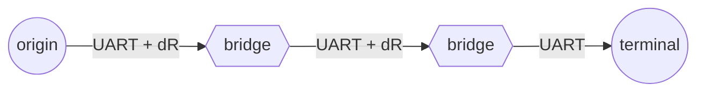

# htoyto Protocol – Integration Overview

This document outlines the detailed structure for integrating the **htoyto** protocol ("hello to you too") into a ZMK-based firmware stack. The protocol enables UART-based inter-module communication between a sender and one or more receivers, with rising-edge interrupts for handshake initiation.

> ℹ️ Note: This implementation is ZMK-specific and relies on ZMK's event system. If you plan to reuse `htoyto` in pure Zephyr projects, consider creating a separate generic backend.

---

## 🧽 Node Roles Overview

* `origin` — initiates communication (**1×** occurrence per htoyto chain)
* `bridge` — relays data between nodes (**0 or more** per chain)
* `terminal` — receives and handles commands (**1×** occurrence per chain)

### Visual Topology



> 💡 The topology follows a left-to-right convention. Only the left-most node requires a `dr-gpios` interrupt pin. Bridges pass through data and may generate their own responses.

---

## 📦 Data Frames

### Supported Packet Types

| Frame                      | Description                                                             |
| -------------------------- | ----------------------------------------------------------------------- |
| `HLO <node_id>`            | Initiates handshake from origin                                         |
| `IAM <node_id>`            | Identity declaration from terminal or bridge                            |
| `EST <node_id>`            | Establish link — sent by both origin and terminal to confirm connection |
| `DKW <message>`            | Rejection — origin to terminal with reason (e.g., unknown node)         |
| `TLK <source,target,data>` | Application-level message                                               |
| `ACK <ref>` (optional)     | Acknowledgment of a `TLK` frame                                         |

> 💡 `DKW` is always sent by the origin to a node it refuses to accept. `EST` completes a handshake only if echoed from both sides.

---

## 🤝 Handshake: Node Lifecycle

### ✅ Successful Node Adding

**Sequence (Origin ➔ Terminal)**

1. Origin detects rising edge on `dR` line
2. Origin sends: `HLO <origin_id>`
3. Terminal responds: `IAM <terminal_id>`
4. Origin sends: `EST <origin_id>`
5. Terminal sends: `EST <terminal_id>`

**Emitted Events**

* Origin emits: `HTOYTO_EVENT_NODE_ADDED`
* Terminal emits: `HTOYTO_EVENT_NODE_ADDED`

---

### ✅ Successful Node Removal

**Sequence (Origin ➔ Terminal)**

1. Origin detects **falling edge** on `dR` line (physical disconnect or deliberate teardown)

**Emitted Events**

* Origin emits: `HTOYTO_EVENT_NODE_REMOVED`
* Terminal emits: `HTOYTO_EVENT_NODE_REMOVED`

---

### ❌ Failure: Terminal Not Supported

**Sequence**

1. Origin sends: `HLO <origin_id>`
2. Terminal responds: `IAM <terminal_id>`
3. Origin sends: `DKW <reason>`

**Emitted Events**

* Origin emits: `HTOYTO_EVENT_NODE_ADDED_FAILED`
* Terminal emits: `HTOYTO_EVENT_NODE_ADDED_FAILED`

---

### ❌ Failure: Timeout

#### Sub-case A: No IAM from Terminal

* Origin sends: `HLO <origin_id>`
* ⏱️ Terminal does not respond with `IAM` in \[xx ms]

**Emitted Events**

* Origin emits: `HTOYTO_EVENT_NODE_ADDED_FAILED`
* Terminal emits: `HTOYTO_EVENT_NODE_ADDED_FAILED`

#### Sub-case B: No EST from Terminal

* Origin sends: `EST <origin_id>`
* ⏱️ Terminal does not respond with `EST <terminal_id>` in \[xx ms]

**Emitted Events**

* Origin emits: `HTOYTO_EVENT_NODE_ADDED_FAILED`
* Terminal emits: `HTOYTO_EVENT_NODE_ADDED_FAILED`

#### Sub-case C: No EST from Origin

* Terminal sends: `IAM <terminal_id>`
* ⏱️ Origin does not respond with `EST <origin_id>` in \[xx ms]

**Emitted Events**

* Origin emits: `HTOYTO_EVENT_NODE_ADDED_FAILED`
* Terminal emits: `HTOYTO_EVENT_NODE_ADDED_FAILED`

---

## 🗂️ Project Structure

### 1. Device Tree Files

#### DTS Overlay

* **Path:** `app/boards/arm/etzee/left.overlay` (origin) and `app/boards/arm/etzee/right.overlay` (terminal)
* **Purpose:** Defines `htoyto` device nodes per side

```dts
/ {
    htoyto0: htoyto {
        compatible = "etzee,htoyto-zmk";
        status = "okay";
        role = "origin"; /* on left side */
        uart = <&uart0>;
        dr-gpios = <&gpio1 11 (GPIO_ACTIVE_HIGH | GPIO_PULL_DOWN)>;
        node-id = "left_leg";
    };
};
```

```dts
/ {
    htoyto0: htoyto {
        compatible = "etzee,htoyto-zmk";
        status = "okay";
        role = "terminal"; /* on right side */
        uart = <&uart0>;
        node-id = "right_leg";
    };
};
```

#### YAML Binding

* **Path:** `app/dts/bindings/htoyto/htoyto.yaml`
* **Purpose:** Describes properties (`uart`, `dr-gpios`, `role`, etc.)

```yaml
compatible: "etzee,htoyto-zmk"

include: base.yaml

properties:
  uart:
    type: phandle
    required: true
    description: UART device used for htoyto communication

  dr-gpios:
    type: phandle-array
    required: false
    description: >
      GPIO pin used for rising edge interrupt (dR line).
      Required only for origin and bridge roles.
      Although only one pin is used, Zephyr requires 'gpios' to be plural
      because the property value is a structured array of controller, pin, and flags.

  role:
    type: string
    required: true
    enum:
      - origin
      - bridge
      - terminal
    description: >
      Role of the htoyto node:
        - origin: initiates communication (left-facing connection)
        - bridge: forwards from left to right (middle node)
        - terminal: receives commands (right-facing connection)

  node-id:
    type: string
    required: true
    description: >
      A unique identifier for the node in the htoyto network.
      Used to route or trigger logic based on physical orientation or connection topology.
```

> 💡 In physical design, a node with pogo pins on **both sides** can act as a **bridge**: a terminal on the left and an origin on the right. This makes `node-id` essential for identification and orchestration.

---

### 2. C Header and Source Files

#### Header File

* **Path:** `app/include/htoyto/htoyto.h`
* **Purpose:** Public API, status enums, macros, event declarations

#### Source File

* **Path:** `app/src/htoyto/htoyto.c`
* **Purpose:** Handles init, handshake logic, GPIO ISR, UART read/write, event emission, and command callback registration

---

### 3. Kconfig Integration

#### Kconfig File

* **Path:** `app/src/htoyto/Kconfig`

```kconfig
config HTOYTO_ENABLED
    bool "Enable htoyto protocol"
    default y
    help
      Enables the etzee htoyto protocol support for UART-based inter-module communication.
```

#### Include in Tree

* **Path:** `app/src/Kconfig`

```kconfig
source "src/htoyto/Kconfig"
```

---

### 4. CMake Integration

#### Main Include

* **Path:** `app/src/CMakeLists.txt`

```cmake
add_subdirectory(htoyto)
```

#### htoyto-specific File

* **Path:** `app/src/htoyto/CMakeLists.txt`

```cmake
zephyr_library_sources(htoyto.c events/event.c)
zephyr_include_directories(${CMAKE_CURRENT_SOURCE_DIR}/../../include)
```

---

### 5. Event System

#### Event Header

* **Path:** `app/include/htoyto/events/event.h`
* **Purpose:** Defines `htoyto_event` structure and event types:

```c
enum htoyto_event_type {
    HTOYTO_EVENT_NODE_ADDED,
    HTOYTO_EVENT_NODE_ADDED_FAILED,
    HTOYTO_EVENT_NODE_REMOVED,
    HTOYTO_EVENT_TLK_RECEIVED,
    HTOYTO_EVENT_ACK_RECEIVED,
    HTOYTO_EVENT_ACK_TIMEOUT
};
```

These events allow communication and state changes to propagate across the system. You may attach listeners to trigger animation, sound, or haptic behavior via a story board system.

---

### 6. Board Setup (Custom Board)

If building a custom board:

* Use `left.overlay` and `right.overlay` under `app/boards/arm/etzee/`
* Add UART, GPIO, and htoyto config to corresponding `.conf` files

---

### 7. Build Config

#### Conf File

* **Path:** `app/boards/arm/etzee/<left|right>.conf`

```conf
CONFIG_SERIAL=y
CONFIG_UART_INTERRUPT_DRIVEN=y
CONFIG_HTOYTO_ENABLED=y
CONFIG_HTOYTO_UART_RX_TIMEOUT_MS=100
CONFIG_HTOYTO_HANDSHAKE_TIMEOUT_MS=200
CONFIG_HTOYTO_MAX_NODE_ID_LENGTH=16
```

---

### ✅ Summary of File Locations

| Type           | Path                                                 |   |
| -------------- | ---------------------------------------------------- | - |
| DTS Overlay    | `app/boards/arm/etzee/left.overlay`, `right.overlay` |   |
| YAML Binding   | `app/dts/bindings/htoyto/htoyto.yaml`                |   |
| Header File    | `app/include/htoyto/htoyto.h`                        |   |
| Source File    | `app/src/htoyto/htoyto.c`                            |   |
| Kconfig        | `app/src/htoyto/Kconfig`                             |   |
| CMakeLists.txt | `app/src/htoyto/CMakeLists.txt`                      |   |
| Event Header   | `app/include/htoyto/events/event.h`                  |   |
| Event Source   | `app/src/htoyto/events/event.c`                      |   |
| Build Config   | `app/boards/arm/etzee/<left`, `right>.conf`          |   |

---

## 🔮 Future Expansion: Story Board Engine

You plan to integrate a second hardware module (dot matrix display, ambient light sensor, beeper) that reacts to htoyto events. A third software component — the **story board engine** — will:

* React to `htoyto_event` events (e.g., `NODE_ADDED`)
* Trigger and play storyboards, defined as animations (with keyframes) + optional audio or haptic effects
* Tailor the experience depending on the `node-id`

This system will allow rich interactions like:

* 🎮 Playing light/audio animations when a certain module connects
* 🎧 Triggering beeps or tones synced to keyframe animation
* 🪏 Optionally driving haptics to complete the effect

This design allows creative UI/UX behaviors inside the firmware, making every module connection feel alive.

Stay tuned for a dedicated story board architecture document.
